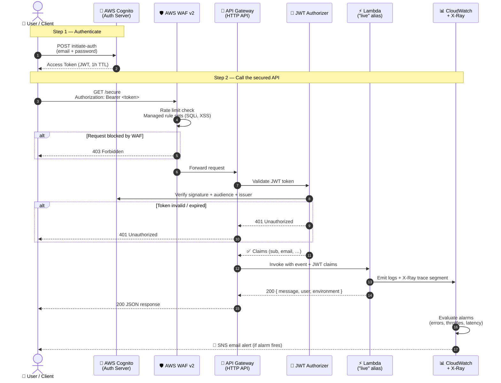
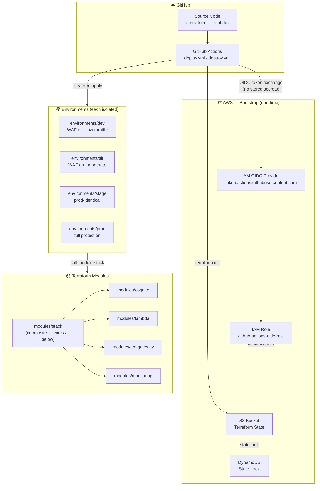
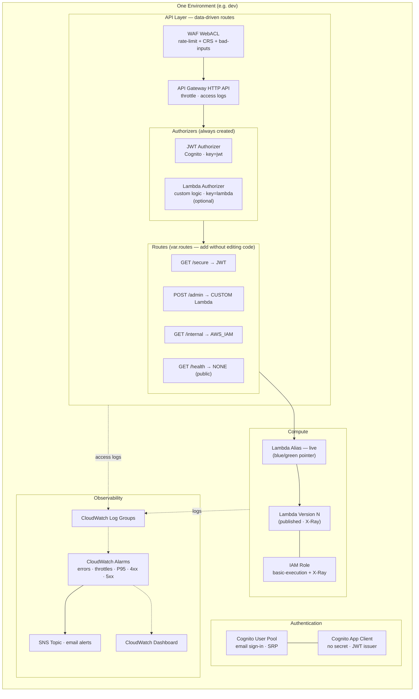

# API Gateway Terraform — Production-Ready

A production-grade, multi-environment AWS API Gateway deployment using Terraform modular design, GitHub Actions CI/CD with OIDC authentication, Cognito JWT authorization, CloudWatch monitoring, WAF protection, and Lambda blue/green deployments.

---

## Architecture

### 1 — Runtime Request Flow



---

### 2 — Infrastructure & Module Structure



---

### 3 — CI/CD Pipeline Flow

```mermaid
flowchart TD
    push["git push<br/>(any branch)"] --> plan_job

    subgraph plan_job["plan-dev job (non-main branches + PRs)"]
        fmt["terraform fmt -check"] --> init1["terraform init"]
        init1 --> validate["terraform validate"]
        validate --> plan["terraform plan dev"]
        plan --> comment{"Is it a PR?"}
        comment -- Yes --> pr_comment["Post plan summary<br/>as PR comment ✅"]
        comment -- No --> done1["Done — dev plan visible<br/>in Actions log"]
    end

    merge["Merge PR → main<br/>(git push origin main)"] --> deploy_job

    subgraph deploy_job["deploy job (main branch only — sequential gate)"]
        d1["terraform apply dev ✅"] --> d2["terraform apply sit ✅"]
        d2 --> d3["terraform apply stage ✅"]
        d3 --> d4["terraform apply prod 🚀"]
        d1 -- "fails?" --> stop["❌ Pipeline stops<br/>sit / stage / prod untouched"]
    end

    manual["Manual trigger<br/>(GitHub Actions UI)"] --> destroy_job

    subgraph destroy_job["destroy job (workflow_dispatch only)"]
        pick["Select environment<br/>from dropdown"] --> type_confirm["Type env name<br/>to confirm"]
        type_confirm --> safety{"Confirm == Selected?"}
        safety -- No --> abort["❌ ABORT<br/>Nothing destroyed"]
        safety -- Yes --> preview["terraform plan -destroy<br/>(preview)"]
        preview --> destroy["terraform destroy ✅"]
        destroy --> summary["Write Actions<br/>job summary"]
    end
```



---

### 4 — AWS Resources Per Environment



---

## Adding Routes & Auth Types

Routes are **not hardcoded** — they are a Terraform variable. You never edit `main.tf` to add a route. Instead, change the `routes` variable in your environment's `variables.tf` or `terraform.tfvars`.

### The four auth types

```hcl
# In environments/dev/terraform.tfvars (or any environment)
routes = {
  # 1. JWT — Cognito end-user auth (current default)
  #    Client logs in to Cognito, gets an Access Token, passes it as Bearer.
  "GET /secure" = { authorization_type = "JWT", authorizer_key = "jwt" }

  # 2. CUSTOM — Lambda authorizer (your own auth logic)
  #    Validate your own token format, look up API keys in DynamoDB,
  #    call an external OAuth/SAML IdP, check an IP allow-list — anything.
  #    Also set lambda_authorizer_uri in your environment.
  "POST /admin" = { authorization_type = "CUSTOM", authorizer_key = "lambda" }

  # 3. AWS_IAM — SigV4 signed requests (service-to-service)
  #    Another Lambda, ECS task, or EC2 instance calling this API
  #    must sign the request with AWS credentials. No Bearer token needed.
  "GET /internal" = { authorization_type = "AWS_IAM", authorizer_key = null }

  # 4. NONE — Public, no auth
  #    Health checks, public webhooks, OAuth redirect URIs,
  #    or any endpoint that should be open to the internet.
  "GET /health"    = { authorization_type = "NONE", authorizer_key = null }
  "POST /webhook"  = { authorization_type = "NONE", authorizer_key = null }
}
```

### Adding a Lambda custom authorizer

1. Deploy your authorizer Lambda (can be in the same or a different Terraform stack)
2. Add to your environment `terraform.tfvars`:

```hcl
routes = {
  "GET /secure"  = { authorization_type = "JWT",    authorizer_key = "jwt"    }
  "POST /admin"  = { authorization_type = "CUSTOM", authorizer_key = "lambda" }
}

lambda_authorizer_uri           = "arn:aws:apigateway:eu-north-1:lambda:path/2015-03-31/functions/arn:aws:lambda:eu-north-1:123456789012:function:my-authorizer/invocations"
lambda_authorizer_function_name = "my-authorizer"
lambda_authorizer_cache_ttl     = 300   # cache result 5 min in prod
```

3. `git push` → pipeline applies the change. No code edits required.

---

## Repository Structure

```
.
├── .github/
│   └── workflows/
│       ├── deploy.yml              # All-in-one: plan on branches, apply on main
│       ├── terraform-plan.yml      # (deprecated — logic merged into deploy.yml)
│       └── destroy.yml             # Manual trigger only: safely destroys one environment
├── environments/
│   ├── dev/                        # Local development — WAF off, low throttling
│   │   ├── backend.tf              # S3 remote state (dev/terraform.tfstate)
│   │   ├── main.tf                 # ← THIN: calls module "stack" with dev defaults
│   │   ├── outputs.tf              # ← THIN: delegates to module.stack.*
│   │   ├── providers.tf            # AWS provider + required_providers
│   │   ├── variables.tf            # Dev-specific DEFAULTS only (types from stack)
│   │   └── terraform.tfvars.example
│   ├── sit/                        # System Integration Testing — WAF on, moderate limits
│   │   └── (same 6 files)
│   ├── stage/                      # Pre-production — production-identical config
│   │   └── (same 6 files)
│   └── prod/                       # Production — full protection, 90d log retention
│       └── (same 6 files)
├── modules/
│   ├── stack/                      # ★ COMPOSITE MODULE — single source of truth
│   │   ├── main.tf                 # Wires cognito + lambda + api-gateway + monitoring
│   │   ├── variables.tf            # Canonical variable definitions (no defaults)
│   │   └── outputs.tf              # All stack outputs in one place
│   ├── api-gateway/
│   │   ├── main.tf                 # HTTP API, JWT authorizer, routes, stage, permissions
│   │   ├── logging.tf              # CloudWatch access log group
│   │   ├── waf.tf                  # WAF WebACL + association (toggle with enable_waf)
│   │   ├── variables.tf
│   │   └── outputs.tf
│   ├── cognito/
│   │   ├── main.tf                 # User pool + app client (email auth, SRP)
│   │   ├── variables.tf
│   │   └── outputs.tf
│   ├── lambda/
│   │   ├── main.tf                 # Function, IAM, X-Ray, versioning, live alias
│   │   ├── variables.tf
│   │   └── outputs.tf
│   └── monitoring/
│       ├── main.tf                 # SNS, CloudWatch alarms, 6-widget dashboard
│       ├── variables.tf
│       └── outputs.tf
├── lambda/
│   └── src/
│       └── index.js                # Lambda handler (auto-zipped by Terraform)
├── scripts/
│   └── bootstrap-state.sh          # One-time: S3 bucket, DynamoDB, OIDC, IAM role
├── .gitignore
├── README.md                       # This file — architecture, features, CI/CD overview
└── SETUP.md                        # ★ Full step-by-step setup from zero (start here)
```

### Code reuse design

```
environments/dev/main.tf   environments/sit/main.tf   environments/stage/main.tf   environments/prod/main.tf
         │                          │                           │                           │
         └──────────────────────────┴───────── module "stack" ──┴───────────────────────────┘
                                              modules/stack/main.tf
                                              (single source of truth)
                                    ┌──────────┬────────────┬─────────────┬─────────────┐
                                    │ cognito  │   lambda   │ api-gateway │  monitoring │
                                    └──────────┴────────────┴─────────────┴─────────────┘
```

**Rule**: never add wiring logic directly in `environments/*/main.tf`.  
To change how modules connect → edit `modules/stack/main.tf`.  
To add a new environment → copy `environments/dev/`, change the `environment = "..."` value and defaults.

---

## Prerequisites

| Tool | Version | Install guide |
|------|---------|--------------|
| AWS Account | — | [SETUP.md → Step 1](./SETUP.md#step-1--create-an-aws-account) |
| AWS CLI | ≥ 2.x | [SETUP.md → Step 2a](./SETUP.md#2a--aws-cli) |
| Terraform | ≥ 1.3.0 | [SETUP.md → Step 2b](./SETUP.md#2b--terraform) |
| Node.js | 18.x | [SETUP.md → Step 2c](./SETUP.md#2c--nodejs-18) |
| Git | any | [SETUP.md → Step 2d](./SETUP.md#2d--git) |
| GitHub repo | — | [SETUP.md → Step 4](./SETUP.md#step-4--create-and-configure-the-github-repository) |

---

## Quick Start

> 📖 **New to AWS or starting from scratch?**  
> Follow the **[Complete Setup Guide (SETUP.md)](./SETUP.md)** — it covers every step from creating an AWS account to calling the live API, with cost estimates and troubleshooting tips.

### TL;DR (if you already have AWS + tools installed)

```bash
# 1. Bootstrap S3 state bucket, DynamoDB lock table, OIDC provider, IAM role
export AWS_REGION=eu-north-1
export GITHUB_ORG=your-org
export GITHUB_REPO=api-gateway-terraform
export BUCKET_NAME=tf-state-$(aws sts get-caller-identity --query Account --output text)
bash scripts/bootstrap-state.sh

# 2. Add AWS_ROLE_ARN + ALARM_EMAIL secrets to each GitHub Environment
#    (dev, sit, stage, prod) — Settings → Environments → Add secret

# 3. Push to a feature branch → watch plan-dev job run
git push origin feature/my-branch

# 4. Merge to main → watch deploy job apply dev
git push origin main
```


---

## CI/CD Workflow

Both jobs live in a **single workflow file** (`.github/workflows/deploy.yml`) with `if:` conditions to branch behaviour by the triggering branch.

```
Any feature branch push ──► plan-dev job
  e.g. git push origin feature/my-change     ├── fmt check (whole repo)
                                             ├── validate
                                             └── terraform plan [dev] only

Pull Request to main ──────► plan-dev job
  (same as above, plus)                      └── posts plan summary as PR comment ✅

Merge / push to main ──────► deploy job  (strict sequential gate)
                               ├── 1. terraform apply [dev]    ✅ must pass
                               │
                               │   ── expand matrix when ready ──
                               ├── 2. terraform apply [sit]    (add to matrix)
                               ├── 3. terraform apply [stage]  (add to matrix)
                               └── 4. terraform apply [prod]   (add to matrix)
```

### Expanding the deploy pipeline

When you are ready to promote beyond dev, open `.github/workflows/deploy.yml` and change one line:

```yaml
# Before (current — dev only)
environment: [dev]

# After (full pipeline)
environment: [dev, sit, stage, prod]
```

### Destroying resources

Use the **Terraform Destroy** workflow — manual trigger only, never runs automatically.

```
GitHub Actions → Terraform Destroy → Run workflow
  Input 1: select environment (dev / sit / stage / prod)
  Input 2: type the environment name to confirm

  Safety Check job  →  validates confirm == selected environment
        ↓ (aborts if mismatch)
  Destroy job       →  terraform plan -destroy (preview)
                    →  terraform destroy -auto-approve
                    →  posts summary (who, when, status)
```

See [SETUP.md → Cleanup](./SETUP.md#cleanup--destroy-all-resources) for full details including manual cleanup of bootstrap resources.

**Authentication**: GitHub Actions uses OIDC to exchange a short-lived GitHub token for AWS credentials. **No static `AWS_ACCESS_KEY_ID` / `AWS_SECRET_ACCESS_KEY` secrets are stored** anywhere.

---

## Getting a Token & Calling the API

> 📋 **Full testing guide with all scenarios, security tests, WAF tests, observability checks, and a health-check script:**  
> See **[TESTING.md](./TESTING.md)**

### Quick smoke test after a deploy

```bash
ENV=dev
SECURE_URL=$(terraform -chdir=environments/$ENV output -raw secure_endpoint)
USER_POOL_ID=$(terraform -chdir=environments/$ENV output -raw cognito_user_pool_id)
CLIENT_ID=$(terraform -chdir=environments/$ENV output -raw cognito_client_id)

# 1. Create test user (first time only)
aws cognito-idp admin-create-user \
  --user-pool-id "$USER_POOL_ID" --username "test@example.com" \
  --temporary-password "Temp1!" --message-action SUPPRESS --region eu-north-1

aws cognito-idp admin-set-user-password \
  --user-pool-id "$USER_POOL_ID" --username "test@example.com" \
  --password "Perm2@" --permanent --region eu-north-1

# 2. Get token
TOKEN=$(aws cognito-idp initiate-auth \
  --auth-flow USER_PASSWORD_AUTH --client-id "$CLIENT_ID" \
  --auth-parameters USERNAME="test@example.com",PASSWORD="Perm2@" \
  --region eu-north-1 --query "AuthenticationResult.AccessToken" --output text)

# 3. Should succeed → 200
curl -s -H "Authorization: Bearer $TOKEN" -w "\nHTTP: %{http_code}\n" "$SECURE_URL"

# 4. Should fail → 401 (no token)
curl -s -w "\nHTTP: %{http_code}\n" "$SECURE_URL"
```

---

## Production Features

| Feature | Implementation |
|---------|---------------|
| **JWT Auth** | API Gateway JWT authorizer validates Cognito Access Tokens on every request |
| **WAF** | Rate limiting (per-IP) + AWS managed CRS + known-bad-inputs rules |
| **API Throttling** | `throttling_burst_limit` + `throttling_rate_limit` on API stage |
| **X-Ray Tracing** | Active tracing on Lambda; traces visible in X-Ray service map |
| **Blue/Green** | `publish = true` + `live` alias; update alias to roll back instantly |
| **CloudWatch Alarms** | Lambda errors, throttles, P95 duration; API 4xx/5xx |
| **Dashboard** | 6-widget CloudWatch dashboard with all key metrics |
| **SNS Alerts** | Email notifications on alarm state changes |
| **Remote State** | S3 (versioned + encrypted) + DynamoDB lock table |
| **Multi-env** | `dev` (lower limits, WAF off) and `prod` (full protection) |
| **OIDC Auth** | GitHub Actions assumes IAM role via OIDC — no static secrets |
| **Log Retention** | 14 days (dev), 90 days (prod), controlled by Terraform |

---

## Environment Differences

| Setting | dev | sit | stage | prod |
|---------|-----|-----|-------|------|
| WAF | ❌ Off | ✅ On | ✅ On | ✅ On |
| Throttle burst | 50 | 100 | 500 | 500 |
| Throttle rate | 25 req/s | 50 req/s | 200 req/s | 200 req/s |
| WAF rate limit | 500/5min | 1000/5min | 2000/5min | 2000/5min |
| Log retention | 14 days | 30 days | 90 days | 90 days |
| `alarm_email` | Has default | Has default | **Required** | **Required** |
| State key | `dev/terraform.tfstate` | `sit/terraform.tfstate` | `stage/terraform.tfstate` | `prod/terraform.tfstate` |

**SIT** — System Integration Testing. WAF on, moderate limits. Validates that all integrated services work together under near-realistic conditions before promoting to stage.

**Stage** — Pre-production. Production-identical config. The final gate: if it works here, it works in prod.

---

## Blue/Green Deployments

Lambda versioning is enabled (`publish = true`). The `live` alias always points to the latest published version. API Gateway calls the alias, not the function directly.

**To roll back** to a previous version:
```bash
aws lambda update-alias \
  --function-name api-demo-prod-lambda \
  --name live \
  --function-version <previous-version-number>
```

For automated canary traffic shifting, integrate **AWS CodeDeploy** with the `live` alias — the Terraform foundation is already in place.

