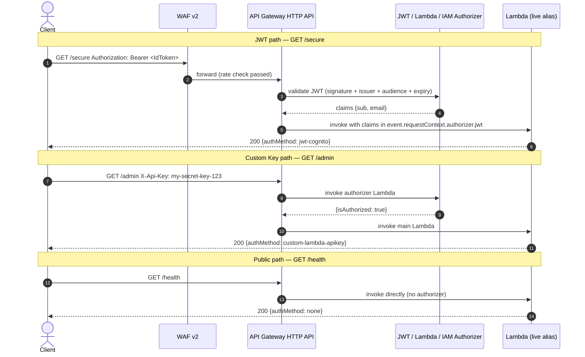
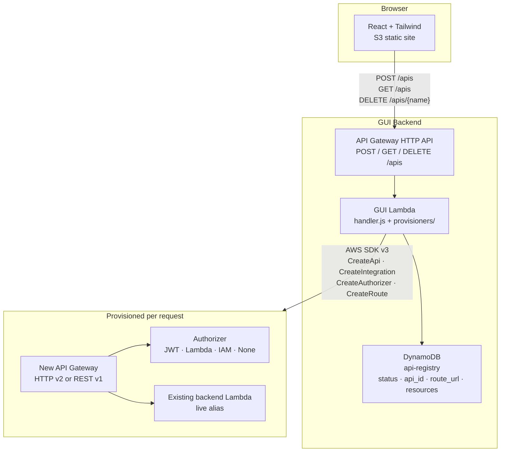

# API Gateway Terraform

Production-grade AWS API Gateway with multi-auth (JWT, Custom Lambda, AWS IAM, Public) deployed across 4 environments via Terraform, plus a self-service GUI portal for provisioning new APIs on-demand.

---

## Flow 1 — Core API Stack

### What it does

Deploys a fully protected HTTP API (v2) backed by a single Lambda function. Every route uses a different auth strategy — demonstrating all four API Gateway v2 auth types in one stack.

| Route | Auth | How |
|---|---|---|
| `GET /secure` | JWT — Cognito | API GW validates the `Bearer` token signature, issuer, audience and expiry natively — Lambda never sees invalid tokens |
| `GET /admin` | Custom Lambda | A second Lambda reads the `X-Api-Key` header and returns `{ isAuthorized: true/false }` — 5 min cache reduces cold invocations |
| `GET /internal` | AWS IAM SigV4 | Only callers that sign requests with valid AWS credentials and `execute-api:Invoke` permission reach the Lambda |
| `GET /health` | None (public) | No auth — open to anyone |

### Architecture


```mermaid
sequenceDiagram
    autonumber
    actor C as Client
    participant WAF as WAF v2
    participant GW as API Gateway HTTP API
    participant Auth as JWT / Lambda / IAM Authorizer
    participant L as Lambda (live alias)

    Note over C,L: JWT path — GET /secure
    C->>WAF: GET /secure  Authorization: Bearer <IdToken>
    WAF->>GW: forward (rate check passed)
    GW->>Auth: validate JWT (signature + issuer + audience + expiry)
    Auth-->>GW: claims {sub, email}
    GW->>L: invoke with claims in event.requestContext.authorizer.jwt
    L-->>C: 200 {authMethod: jwt-cognito}

    Note over C,L: Custom Key path — GET /admin
    C->>GW: GET /admin  X-Api-Key: my-secret-key-123
    GW->>Auth: invoke authorizer Lambda
    Auth-->>GW: {isAuthorized: true}
    GW->>L: invoke main Lambda
    L-->>C: 200 {authMethod: custom-lambda-apikey}

    Note over C,L: Public path — GET /health
    C->>GW: GET /health
    GW->>L: invoke directly (no authorizer)
    L-->>C: 200 {authMethod: none}
```

### Components & Why

| Component | Why |
|---|---|
| **API Gateway HTTP API v2** | Native JWT authorizer — no Lambda cold-start for token validation. Cheaper per-call than REST API v1. |
| **Cognito User Pool + App Client** | Managed OIDC identity — handles token issuance, refresh, and expiry. No auth server to run. |
| **Lambda — main handler** (`api-demo-{env}-lambda`) | Single function handles all routes. Detects auth type from `event.requestContext.authorizer`. Blue/green via `live` alias. |
| **Lambda — custom authorizer** (`api-demo-{env}-lambda-authorizer`) | Validates `X-Api-Key` header with `enable_simple_responses = true`. Result cached 5 min — Lambda invoked once per key per cache window. |
| **WAF v2** | Rate limiting per IP + AWS managed rules. Enabled in sit/stage/prod, disabled in dev to save cost. |
| **CloudWatch Logs + Alarms + Dashboard** | JSON access logs per request. 5 alarms (errors, throttles, duration). SNS email on breach. |
| **Lambda `live` alias** | Blue/green — rollback in one CLI command by pointing `live` to a previous published version number. |
| **Terraform modules** | `cognito`, `lambda`, `api-gateway`, `monitoring` composed by `stack`. Each environment calls `module.stack` with different knobs. |
| **S3 + DynamoDB (state)** | Remote Terraform state with locking — safe concurrent CI/CD runs. |
| **OIDC (GitHub → AWS)** | No static credentials stored in GitHub. Short-lived tokens exchanged at runtime via `AssumeRoleWithWebIdentity`. |

### Cost (dev environment)

| Service | Cost |
|---|---|
| API Gateway HTTP API — 1 M calls/month free | **$0** |
| Lambda (2 functions) — 1 M req + 400K GB-s free | **$0** |
| Cognito — 50 K MAU free | **$0** |
| CloudWatch Logs — 5 GB/month free | **$0** |
| WAF v2 — disabled in dev | **$0** |
| S3 + DynamoDB (Terraform state) | **$0** |
| **Total dev** | **~$0/month** |

> WAF adds ~**$5/month** when enabled in sit/stage/prod.

---

## Flow 2 — Self-Service GUI Portal

### What it does

A React web app that lets any team member create, inspect, and delete isolated API Gateway endpoints — choosing from 5 auth types — without touching Terraform or the AWS Console. Each provisioned API gets its own API GW ID, routes, and authorizers, tracked in DynamoDB.

**Supported auth types created on-demand:**

| Type | What gets provisioned |
|---|---|
| 🌐 HTTP Public | HTTP API v2, route `AuthorizationType: NONE` |
| 🔐 HTTP JWT | HTTP API v2, JWT authorizer pointing at the existing Cognito pool |
| 🔑 HTTP Custom Key | HTTP API v2, REQUEST-type Lambda authorizer (`X-Api-Key` header) |
| 🛡️ HTTP IAM | HTTP API v2, route `AuthorizationType: AWS_IAM` |
| 📊 REST Usage Plan | REST API v1, usage plan + API key with per-partner daily quota |

### Architecture


```mermaid
graph TD
    subgraph Browser["Browser"]
        UI["React + Tailwind\nS3 static site"]
    end

    subgraph GuiBackend["GUI Backend"]
        GW_GUI["API Gateway HTTP API\nPOST / GET / DELETE /apis"]
        L_GUI["GUI Lambda\nhandler.js + provisioners/"]
        DB["DynamoDB\napi-registry\nstatus · api_id · route_url · resources"]
        GW_GUI --> L_GUI --> DB
    end

    subgraph Provisioned["Provisioned per request"]
        NEW_GW["New API Gateway\nHTTP v2 or REST v1"]
        NEW_AUTH["Authorizer\nJWT · Lambda · IAM · None"]
        EXISTING_L["Existing backend Lambda\nlive alias"]
        NEW_GW --> NEW_AUTH
        NEW_GW --> EXISTING_L
    end

    UI -->|"POST /apis\nGET /apis\nDELETE /apis/{name}"| GW_GUI
    L_GUI -->|"AWS SDK v3\nCreateApi · CreateIntegration\nCreateAuthorizer · CreateRoute"| Provisioned
```

### Components & Why

| Component | Why |
|---|---|
| **S3 static website** | Hosts the compiled React build. No server. `config.js` injected at deploy time so the backend URL is runtime-configurable without a rebuild. |
| **API Gateway HTTP API (GUI)** | Routes browser requests to the GUI Lambda. CORS configured for the S3 origin. |
| **GUI Lambda** (`api-portal-{env}-gui-lambda`) | Runs `handler.js` + 5 provisioner modules. Each provisioner maps to one auth type and calls AWS SDK directly. Stateless — all state in DynamoDB. |
| **DynamoDB** (`api-portal-{env}-api-registry`) | Single-table registry keyed on `api_name`. Tracks `status` (CREATING → ACTIVE → DELETING), `api_id`, `route_url`, full `resources` JSON. On-demand billing — no capacity planning needed. |
| **5 provisioner modules** | One file per auth type (`http-public.js`, `http-jwt.js`, `http-custom-key.js`, `http-iam.js`, `rest-usage-plan.js`). Adding a new auth type = one new file, one registry entry. |
| **Existing Cognito pool (reused)** | JWT provisioner points new APIs at the same pool — no new user pool per API. Zero extra cost. |
| **Existing authorizer Lambda (reused)** | Custom Key provisioner adds a scoped Lambda permission per API — the same authorizer function serves every custom-key API. |
| **React + Tailwind** | SPA for instant feedback. Form validates API name pattern, method, path client-side. Persistent inline error banner on failure shows AWS error code + requestId for CloudWatch lookup. |

### Status lifecycle

```
Create → CREATING → ACTIVE         happy path
                  → FAILED          AWS error mid-provision → Force Clear removes registry entry
Delete → DELETING → (removed)       happy path
                  → DELETE_FAILED   AWS error mid-destroy  → Force Clear removes registry entry
```

### Cost (dev, low traffic)

| Service | Cost |
|---|---|
| S3 static hosting | **$0** |
| API Gateway (GUI API) — < 1 M calls/month | **$0** |
| GUI Lambda — < 1 M invocations | **$0** |
| DynamoDB (on-demand) — < 25 GB | **$0** |
| Each provisioned HTTP API — $1/million calls | **~$0** at low volume |
| Each provisioned REST API — $3.50/million calls | **~$0** at low volume |
| **Total GUI portal** | **~$0/month** |

---

## Repository Structure

```
.
├── environments/
│   ├── dev/          # WAF off, low throttle
│   ├── sit/          # WAF on, moderate limits
│   ├── stage/        # Production-identical settings
│   └── prod/         # Full WAF + throttle
├── modules/
│   ├── stack/        # Composite — wires cognito + lambda + api-gateway + monitoring
│   ├── api-gateway/  # HTTP API, JWT + Lambda authorizers, WAF, access logs
│   ├── cognito/      # User pool + app client
│   ├── lambda/       # Main handler + authorizer fn, blue/green alias, X-Ray
│   └── monitoring/   # SNS, 5 alarms, CloudWatch dashboard
├── lambda/src/
│   ├── index.js      # Main handler — routes by auth context
│   └── authorizer.js # Custom Lambda authorizer — X-Api-Key validation
└── web-gui/
    ├── frontend/     # React + Tailwind SPA
    ├── backend/      # GUI Lambda — handler.js + provisioners/
    └── infrastructure/ # Terraform for GUI stack (S3, API GW, Lambda, DynamoDB)
```
