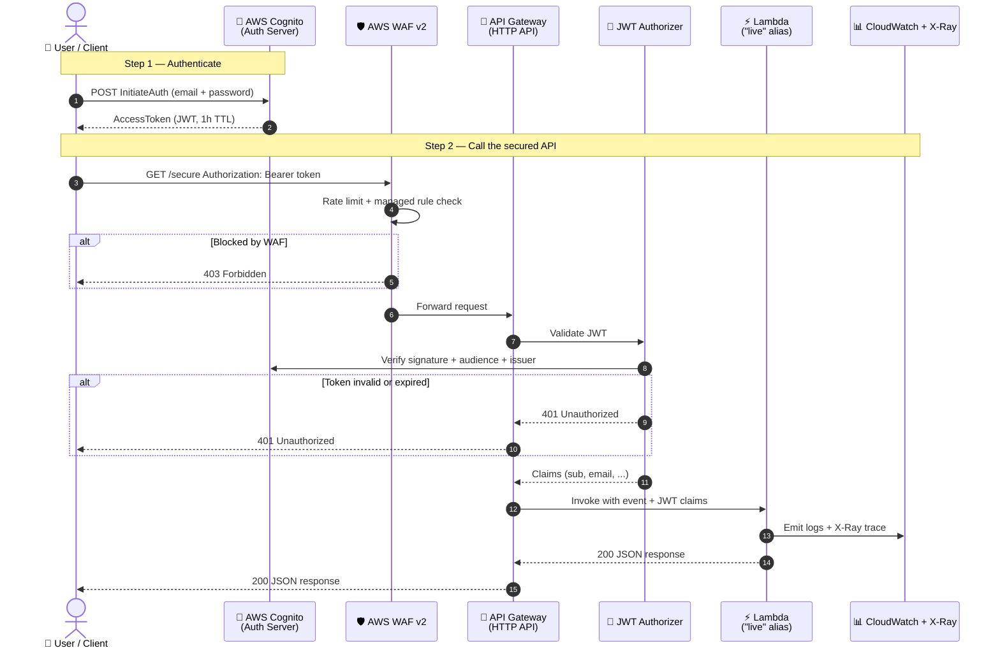
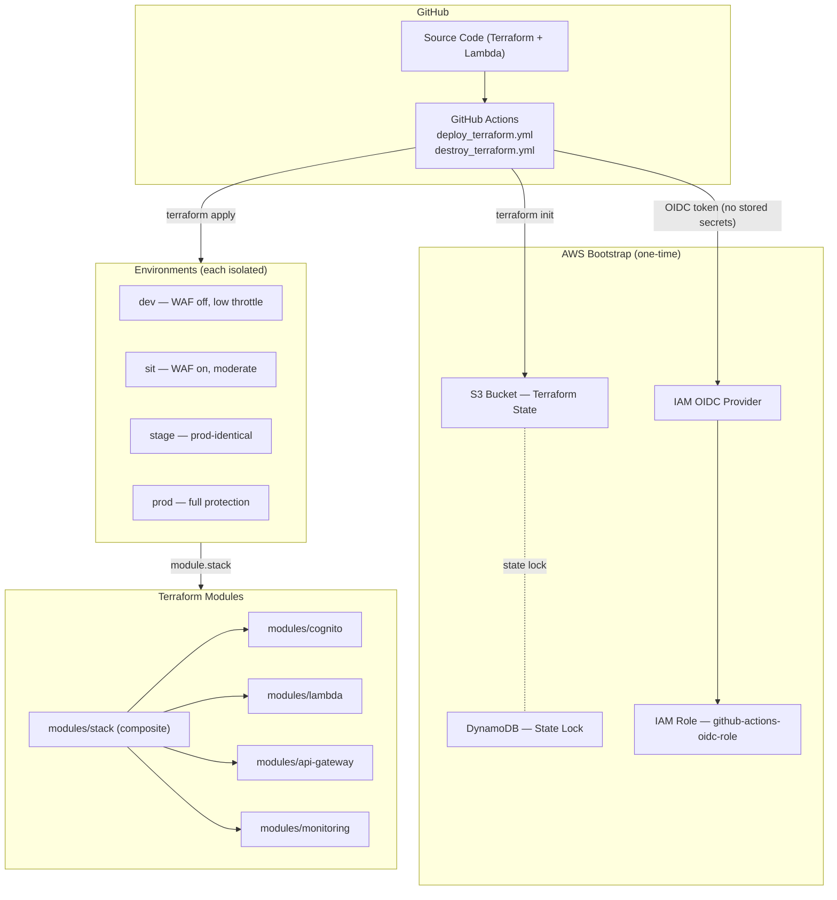
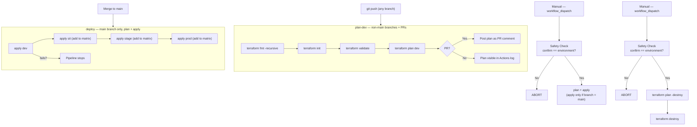
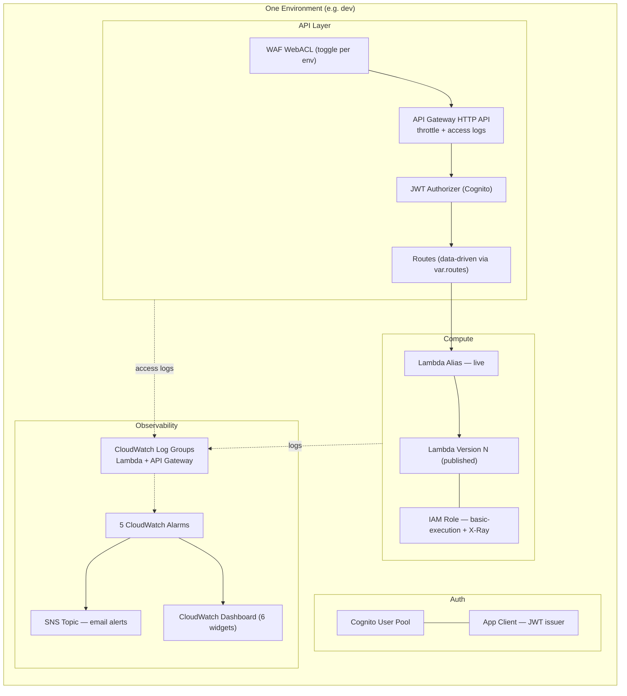

# API Gateway Terraform

A production-grade, multi-environment AWS API Gateway deployment using Terraform modular design, GitHub Actions CI/CD with OIDC authentication, Cognito JWT authorization, CloudWatch monitoring, WAF protection, and Lambda blue/green deployments.

---

## Architecture

### 1 — Runtime Request Flow


```mermaid
sequenceDiagram
    autonumber
    actor User as 👤 User / Client
    participant Cognito as 🔐 AWS Cognito<br/>(Auth Server)
    participant WAF as 🛡️ AWS WAF v2
    participant APIGW as 🚪 API Gateway<br/>(HTTP API)
    participant Auth as 🔑 JWT Authorizer
    participant Lambda as ⚡ Lambda<br/>("live" alias)
    participant CW as 📊 CloudWatch + X-Ray

    Note over User,Cognito: Step 1 — Authenticate
    User->>Cognito: POST InitiateAuth (email + password)
    Cognito-->>User: AccessToken (JWT, 1h TTL)

    Note over User,CW: Step 2 — Call the secured API
    User->>WAF: GET /secure  Authorization: Bearer token
    WAF->>WAF: Rate limit + managed rule check
    alt Blocked by WAF
        WAF-->>User: 403 Forbidden
    end
    WAF->>APIGW: Forward request

    APIGW->>Auth: Validate JWT
    Auth->>Cognito: Verify signature + audience + issuer
    alt Token invalid or expired
        Auth-->>APIGW: 401 Unauthorized
        APIGW-->>User: 401 Unauthorized
    end
    Auth-->>APIGW: Claims (sub, email, ...)

    APIGW->>Lambda: Invoke with event + JWT claims
    Lambda->>CW: Emit logs + X-Ray trace
    Lambda-->>APIGW: 200 JSON response
    APIGW-->>User: 200 JSON response
```

---

### 2 — Infrastructure & Module Structure


```mermaid
graph TB
    subgraph GH["GitHub"]
        code["Source Code (Terraform + Lambda)"]
        actions["GitHub Actions\ndeploy_terraform.yml\ndestroy_terraform.yml"]
    end

    subgraph BOOT["AWS Bootstrap (one-time)"]
        s3["S3 Bucket — Terraform State"]
        dynamo["DynamoDB — State Lock"]
        oidc["IAM OIDC Provider"]
        role["IAM Role — github-actions-oidc-role"]
    end

    subgraph MOD["Terraform Modules"]
        stack["modules/stack (composite)"]
        cog["modules/cognito"]
        lam["modules/lambda"]
        apig["modules/api-gateway"]
        mon["modules/monitoring"]
        stack --> cog & lam & apig & mon
    end

    subgraph ENVS["Environments (each isolated)"]
        dev["dev — WAF off, low throttle"]
        sit["sit — WAF on, moderate"]
        stage["stage — prod-identical"]
        prod["prod — full protection"]
    end

    code --> actions
    actions -- "OIDC token (no stored secrets)" --> oidc --> role
    actions -- "terraform init" --> s3
    s3 -. "state lock" .- dynamo
    ENVS -- "module.stack" --> MOD
    actions -- "terraform apply" --> ENVS
```

---

### 3 — CI/CD Pipeline Flow


```mermaid
flowchart TD
    push["git push (any branch)"] --> plan_job

    subgraph plan_job["plan-dev — non-main branches + PRs"]
        fmt["terraform fmt -recursive"] --> init1["terraform init"]
        init1 --> validate["terraform validate"]
        validate --> plan["terraform plan dev"]
        plan --> comment{"PR?"}
        comment -- Yes --> pr_comment["Post plan as PR comment"]
        comment -- No --> done1["Plan visible in Actions log"]
    end

    merge["Merge to main"] --> deploy_job

    subgraph deploy_job["deploy — main branch only, plan + apply"]
        d1["apply dev"] --> d2["apply sit (add to matrix)"]
        d2 --> d3["apply stage (add to matrix)"]
        d3 --> d4["apply prod (add to matrix)"]
        d1 -- "fails?" --> stop["Pipeline stops"]
    end

    manual_deploy["Manual — workflow_dispatch"] --> safety1["Safety Check\nconfirm == environment?"]
    safety1 -- No --> abort1["ABORT"]
    safety1 -- Yes --> deploy_manual["plan + apply\n(apply only if branch = main)"]

    manual_destroy["Manual — workflow_dispatch"] --> safety2["Safety Check\nconfirm == environment?"]
    safety2 -- No --> abort2["ABORT"]
    safety2 -- Yes --> preview["terraform plan -destroy"] --> destroy["terraform destroy"]
```

---

### 4 — AWS Resources Per Environment


```mermaid
graph LR
    subgraph ENV["One Environment (e.g. dev)"]
        subgraph AUTH["Auth"]
            UP["Cognito User Pool"]
            CLIENT["App Client — JWT issuer"]
            UP --- CLIENT
        end
        subgraph COMPUTE["Compute"]
            ALIAS["Lambda Alias — live"]
            VER["Lambda Version N (published)"]
            ALIAS --> VER
            ROLE["IAM Role — basic-execution + X-Ray"]
            VER --- ROLE
        end
        subgraph API["API Layer"]
            WAF2["WAF WebACL (toggle per env)"]
            GW["API Gateway HTTP API\nthrottle + access logs"]
            JWTAUTH["JWT Authorizer (Cognito)"]
            ROUTE["Routes (data-driven via var.routes)"]
            WAF2 --> GW --> JWTAUTH --> ROUTE --> ALIAS
        end
        subgraph OBS["Observability"]
            LOGGRP["CloudWatch Log Groups\nLambda + API Gateway"]
            ALARMS["5 CloudWatch Alarms"]
            DASH["CloudWatch Dashboard (6 widgets)"]
            SNS["SNS Topic — email alerts"]
            ALARMS --> SNS
        end
        COMPUTE -.->|logs| LOGGRP
        API -.->|access logs| LOGGRP
        LOGGRP -.-> ALARMS --> DASH
    end
```

---

## Repository Structure

```
.
├── .github/
│   └── workflows/
│       ├── deploy_terraform.yml    # plan on branches, apply on main, manual deploy
│       └── destroy_terraform.yml   # manual destroy with safety confirmation
├── environments/
│   ├── dev/                        # WAF off, burst=50, rate=25, logs=14d
│   ├── sit/                        # WAF on, burst=100, rate=50, logs=30d
│   ├── stage/                      # WAF on, burst=500, rate=200, logs=90d
│   └── prod/                       # WAF on, burst=500, rate=200, logs=90d
│       └── (each has: backend.tf, main.tf, outputs.tf, providers.tf, variables.tf, terraform.tfvars.example)
├── modules/
│   ├── stack/                      # Composite module — wires all 4 modules (single source of truth)
│   ├── api-gateway/                # HTTP API, JWT authorizer, data-driven routes, WAF, logging
│   ├── cognito/                    # User pool + app client
│   ├── lambda/                     # Function, IAM, X-Ray, versioning, live alias
│   └── monitoring/                 # SNS, 5 alarms, 6-widget dashboard
├── lambda/
│   └── src/
│       └── index.js                # Lambda handler (auto-zipped by archive_file)
├── scripts/
│   └── bootstrap-state.sh          # One-time: S3, DynamoDB, OIDC, IAM role
├── .gitignore
├── README.md
└── docs/
    ├── index.md                    # Docs landing page + quick links
    ├── setup.md                    # Full setup guide from zero
    └── testing.md                  # Complete test guide with curl + Postman
```

---

## Quick Start

> 📖 **Starting from scratch?** Follow **[docs/setup.md](./docs/setup.md)** — covers everything from creating an AWS account to calling the live API.  
> 🧪 **Testing the API?** See **[docs/testing.md](./docs/testing.md)** — curl, Postman, infrastructure checks, blue/green rollback.

```bash
# 1. Bootstrap (one-time)
export AWS_REGION=eu-north-1
export GITHUB_ORG=your-github-username
export GITHUB_REPO=api-gateway-terraform
export BUCKET_NAME=tf-state-$(aws sts get-caller-identity --query Account --output text)
bash scripts/bootstrap-state.sh

# 2. Add secrets to each GitHub Environment (dev, sit, stage, prod):
#    AWS_ROLE_ARN = arn from bootstrap output
#    ALARM_EMAIL  = your-email@example.com

# 3. Push to feature branch → triggers plan only
git push origin feature/my-branch

# 4. Merge to main → triggers plan + apply on dev
git push origin main
```

---

## CI/CD Workflows

### deploy_terraform.yml

| Trigger | Job | What runs |
|---------|-----|-----------|
| Push to any branch | `plan-dev` | fmt + init + validate + plan (dev only) |
| PR to main | `plan-dev` | same + posts plan table as PR comment |
| Push to main | `deploy` | plan + **apply** (dev only — expand matrix when ready) |
| Manual (`workflow_dispatch`) | `confirm-input` → `deploy-manual` | safety check → plan + **apply** (only if main branch) |

### destroy_terraform.yml

Manual only. Select environment from dropdown + type name to confirm → `terraform destroy`.

### Expanding to all environments (one line change)

```yaml
# In deploy_terraform.yml, change:
environment: [dev]
# to:
environment: [dev, sit, stage, prod]
```

---

## Adding Routes & Auth Types

Routes are a **Terraform variable** — no code edits needed to add routes:

```hcl
# In environments/dev/terraform.tfvars
routes = {
  "GET /secure"   = { authorization_type = "JWT",     authorizer_key = "jwt"    }
  "GET /health"   = { authorization_type = "NONE",    authorizer_key = null     }
  "POST /admin"   = { authorization_type = "CUSTOM",  authorizer_key = "lambda" }
  "GET /internal" = { authorization_type = "AWS_IAM", authorizer_key = null     }
}
```

---

## Terraform Outputs (dev)

| Output | Example value |
|--------|--------------|
| `api_endpoint` | `https://ztdsvilz58.execute-api.eu-north-1.amazonaws.com/` |
| `secure_endpoint` | `https://ztdsvilz58.execute-api.eu-north-1.amazonaws.com/secure` |
| `cognito_user_pool_id` | `eu-north-1_u3Duhelrw` |
| `cognito_client_id` | `59sg1etok9amjiq0vhi6h5bosj` |
| `lambda_function_name` | `api-demo-dev-lambda` |
| `lambda_version` | `4` |
| `dashboard_url` | CloudWatch dashboard URL |
| `sns_topic_arn` | `arn:aws:sns:eu-north-1:397979615352:api-demo-dev-alarms` |
| `waf_arn` | `""` (empty in dev — WAF disabled) |

---

## Environment Differences

| Setting | dev | sit | stage | prod |
|---------|-----|-----|-------|------|
| WAF | Off | On | On | On |
| Throttle burst | 50 | 100 | 500 | 500 |
| Throttle rate | 25/s | 50/s | 200/s | 200/s |
| WAF rate limit | 500/5min | 1000/5min | 2000/5min | 2000/5min |
| Log retention | 14 days | 30 days | 90 days | 90 days |
| State key | `dev/terraform.tfstate` | `sit/terraform.tfstate` | `stage/terraform.tfstate` | `prod/terraform.tfstate` |

---

## Production Features

| Feature | How |
|---------|-----|
| **JWT Auth** | API Gateway JWT authorizer validates Cognito tokens on every request |
| **Multi-auth** | 4 auth types per route: JWT, CUSTOM Lambda, AWS_IAM, NONE |
| **WAF** | Rate limiting + AWS managed CRS + known-bad-inputs (sit/stage/prod) |
| **API Throttling** | Burst + rate limits on API stage, per environment |
| **X-Ray** | Active tracing on Lambda |
| **Blue/Green** | `publish = true` + `live` alias — instant rollback by updating alias |
| **CloudWatch** | 5 alarms, 6-widget dashboard, access logs |
| **SNS Alerts** | Email on alarm state change |
| **Remote State** | S3 (versioned + encrypted) + DynamoDB lock |
| **OIDC Auth** | No static AWS credentials in GitHub — short-lived token exchange |
| **Auto-zip** | `archive_file` zips `lambda/src/` automatically on every apply |

---

## Blue/Green Rollback

```bash
# Roll back to previous version instantly
aws lambda update-alias \
  --function-name api-demo-prod-lambda \
  --name live \
  --function-version <previous-version-number> \
  --region eu-north-1
```

---

## Cost Estimate (dev environment)

| Service | Free tier | Notes |
|---------|-----------|-------|
| Lambda | 1M req/month free | — |
| API Gateway | 1M HTTP calls/month free | — |
| Cognito | 50K MAU free | — |
| CloudWatch | 5 GB logs free | — |
| DynamoDB | 25 GB free | — |
| S3 | 5 GB free | — |
| WAF | **$5/month per WebACL** | Disabled in dev by default |

**Estimated dev cost: ~$0/month** within free tier.
